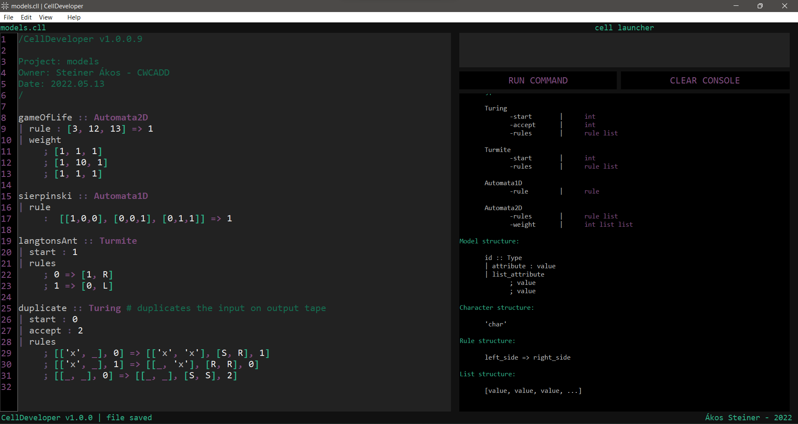
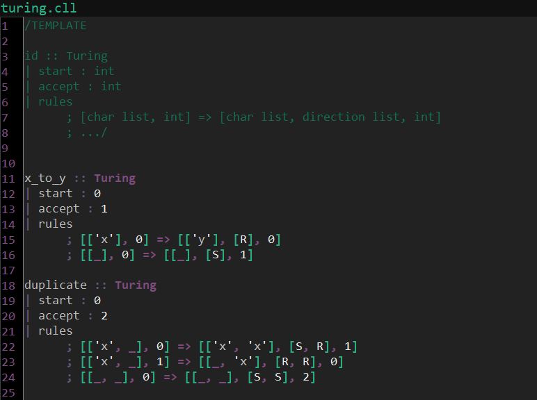
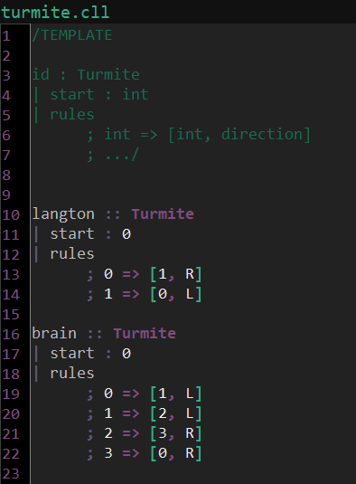
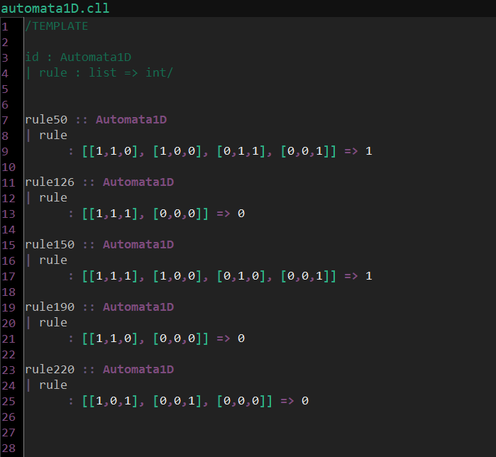
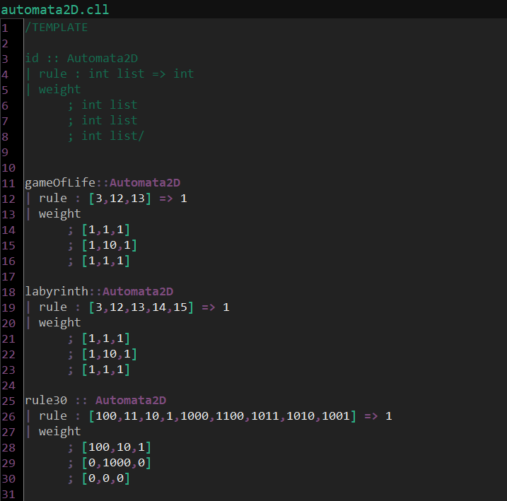
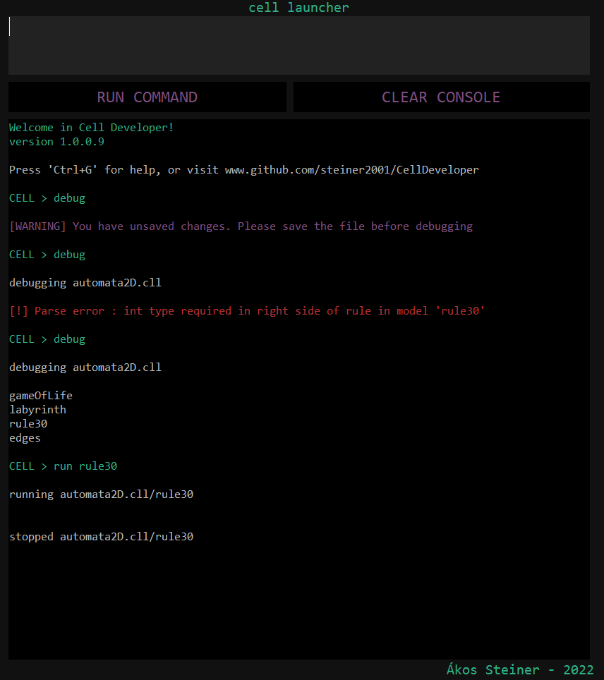
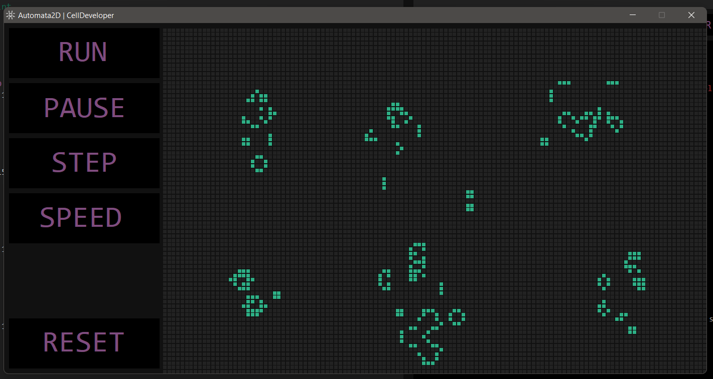
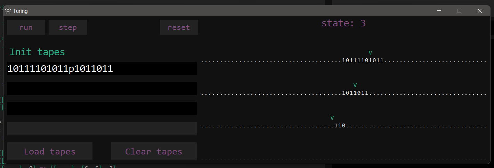

# CellDeveloper
## The software
CellDeveloper is a software for implementing computing model instances intuitively, fast and comfortably. In addition, the software can launch the instances in their modelspecific UIs.



## Compiler
The software works with an own code compiler. The compiler has a unique lexical, syntactical and semantic analizer for understanding the user written code. The program compiles from the personally developed language (CELL) to python.
### Lexical elements
There are three different token types that construct the syntax tree.
* Constant tokens
    * Model types:
        * Turing
        * Turmite
        * Automata1D
        * Automata2D
    * Directions:
        * R (right)
        * L (left)
        * S (stay)
    * Others:
        * _ (none value)
* Regular expressions
    * Integers
    * IDs
* Symbols
    * `::` (model definition)
    * `|` (attribute definition)
    * `:` (attribute declaration)
    * `;` (list attribute declaration)
    * `[ ]` (list)
    * `'` (character)
    * `=>` (rule)
    * `,` (list element separator)
    * `#` (oneline comment)
    * `/ /` (multiline comment)
### Syntax tree
Model structure:
```
id :: Type
| attribute : value
| list_attribute
    ; value
    ; value
```
Character structure:
```
'char'
```
Rule structure:
```
left_side => right_side
```
List structure:
```
[value, value, value, ...]
```
### Model classes
Turing-machines
```
-start		|	int
-accept		|	int
-rules		|	rule list
```


Turmites
```
-start		|	int
-rules		|	rule list
```


1D cellular automatas
```
-rule		|	rule
```


2D cellular automatas
```
-rules		|	rule list
-weight		|	int list list
```


## Command line

The user can run the instances and debug their code in the command line. The different types of messages are shown with different colors as below:



### Valid commands
```
debug				|	debugging current cell file
run <model>			|	runs <model> in shell with cell scale optional
help				|	lists all the valid commands
clear				|	clears console
exit				|	closes CellDeveloper
```

## Model launcher
### Launcher interface for cellular automatas

### Launcher interface for turing-machines
